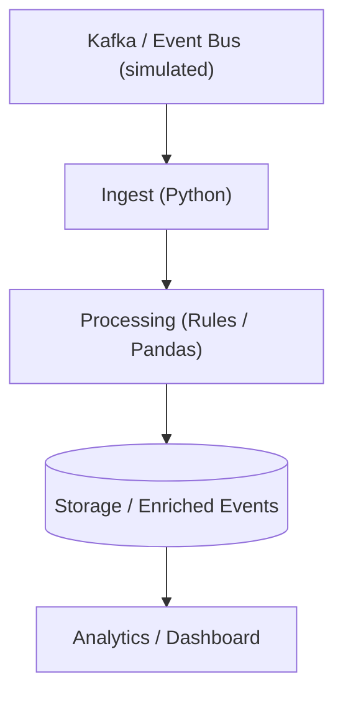
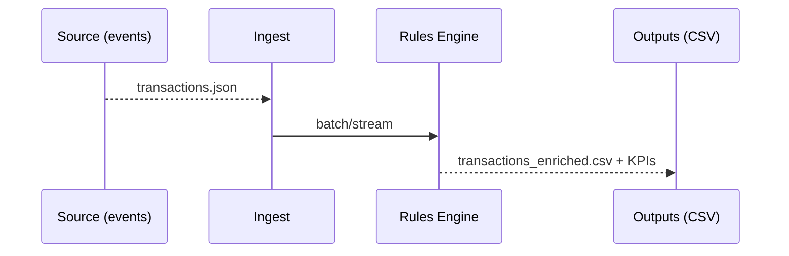
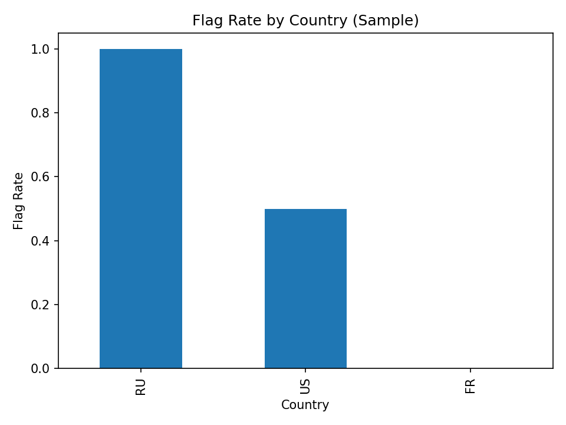

# 🕵️ Real-Time Fraud & Compliance Pipeline

Portfolio project showcasing a streaming-style fraud/compliance pipeline: **Ingest → Rule-based flagging → KPIs & dashboard**. Clean DE structure, diagrams, and ready artifacts so it looks complete.

---

## 🧱 Architecture (Mermaid)


## 🔁 Streaming Data Flow (Mermaid)


---

## ✨ Features
- ⚡ Simulated streaming ingest (file-based) with rules
- 🏷️ Fraud flags: high-value, country risk, channel anomaly, rapid-fire
- 📊 KPIs by country/channel + dashboard image
- 🧱 Repo structured for Kafka/Spark/Snowflake/dbt expansion

---

## 🧰 Tech Stack
| Layer | Tech |
|---|---|
| Ingest | Python (Kafka simulated) |
| Processing | Python (pandas, rule flags) |
| Storage | CSV (enriched) |
| Viz | Streamlit (screenshot) |

---

## 🚀 How to Run (Local)
```bash
pip install -r requirements.txt
python src/ingest/ingest_local.py
python src/transform/flag_and_kpi.py
# optional: Streamlit dashboard
streamlit run dashboards/app.py
```

---

## 📊 Results (Sample)
- **Transactions:** **6**
- **Flag rate:** **50.00%**



---

## 📁 Structure
```
real-time-fraud-compliance-pipeline/
├─ src/
│  ├─ ingest/ingest_local.py
│  ├─ transform/flag_and_kpi.py
│  ├─ rules/ (docs of flags)
│  └─ load/ (optional)
├─ data/
│  ├─ raw/transactions.json
│  └─ processed/
├─ dashboards/app.py
├─ docs/
├─ sql/
├─ requirements.txt
└─ README.md
```

---

## 🏁 Status
**Completed** demo with runnable ingest/transform, KPIs, diagrams, and dashboard image.

